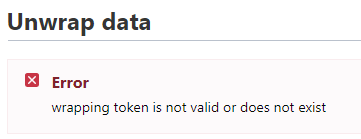

```{r, include = FALSE}
knitr::opts_chunk$set(
  collapse = TRUE,
  comment = "#>"
)
```

#### Create a GitHub Connection

Here you will want to enable the auth method for github via the CLI in your Vault instance.

```bash
vault auth enable github
```

#### Next configure the endpoint for Vault to communicate with GitHub


Here you will enable the GitHub org you are a part of to communicate with GitHub. 

If you do not know how to create a GitHub org you can follow the documentation here: <a href="https://docs.github.com/en/organizations/collaborating-with-groups-in-organizations/creating-a-new-organization-from-scratch" target="_blank">GitHub Org</a>

```bash
vault write auth/github/config organization=<replace-with-your-github-org>
```

#### Map Users or Teams in your GitHub organization to policies in Vault.

```bash
vault write auth/github/map/users/<github-user-in-org> value=all-in-one-policy
```

Example Vault policy for working with secrets. 

***

```json

 path "secret/*" {
  capabilities = ["create", "read", "update", "patch", "delete", "list"]
}

path "kv/*" {
  capabilities = ["create", "read", "update", "patch", "delete", "list"]
}

```

***

***Note: This is a broad policy in Vault and you may want to restrict how your github users interact with Vault.***


#### Retrieve the GitHub token for the github user/group that is configured

```{r eval=FALSE}
vault_git_token<-  get_github_token(url='vault.url.com',github_token='ghp_12345abcdef')
```


#### Get/Retrieve secrets from Vault via the GitHub token

```{r eval=FALSE}
get_vault_data(url = "vault-url.com",path = "secret-path",token = vault_git_token)
```
      
#### Wrap secrets via vault

This function allows you to wrap secrets from vault and send them securly to another person via plain text. The vault token returned is only good for a one time use. 


```{r eval=FALSE}
wrap_secrets(url = "vault-url.com",token = vault_git_token ,secrets_to_wrap = list("one"=one,"two"=two),ttl = "30m")
```      

You will see the following error in the vault console if the token to wrap the secrets has already been utilized elsewhere.

